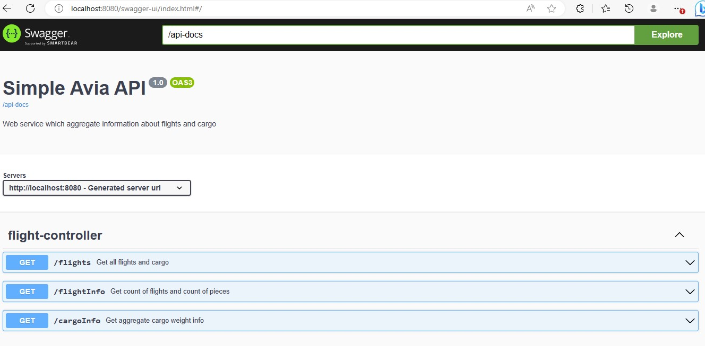
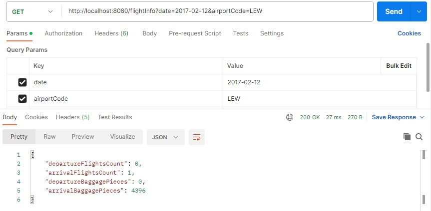
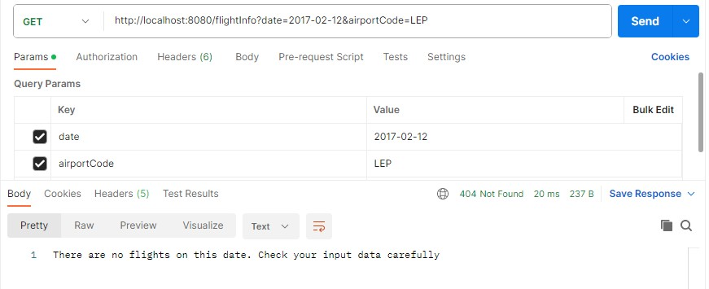
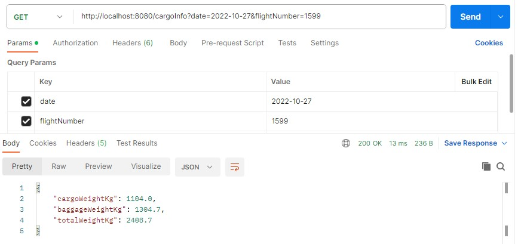
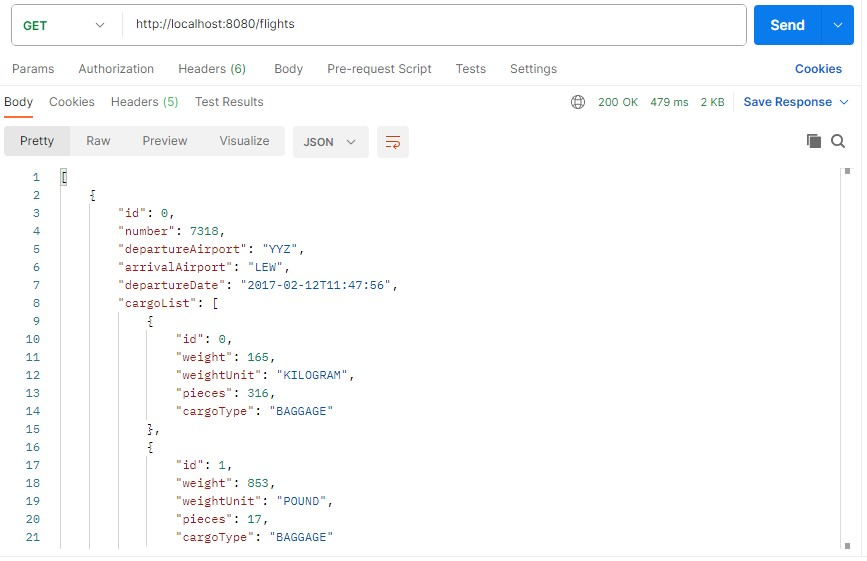

# Simple avia REST service
### *(Spring Boot + PostgreSQL+ OpenApi)*

The app is a server part of the application (without the UI part) for aggregating information about flights and cargoes.  
Provides an API for:  
1. For requested Flight Number and date will respond with following :
      - Cargo Weight for requested Flight
      - Baggage Weight for requested Flight
      - Total Weight for requested Flight  
2. For requested IATA Airport Code and date will respond with following :
      * Number of flights departing from this airport,
      * Number of flights arriving to this airport,
      * Total number (pieces) of baggage arriving to this airport,
      * Total number (pieces) of baggage departing from this airport

Documentation API is designed using OpenApi and is available while the program is running at [swagger-ui.html](http://localhost:8080/swagger-ui.html/).
 

 

## Application launch
1. Git [clone](https://github.com/Laboulaye/simple-avia.git)
2. Create database simple_avia.
3. Change your own data *username/password* at *resources/application.properties*
4. mvn clean; mvn compile
5. Run 'SimpleAviaApplication.java'

## Application work

During application startup, two related tables are created in the database: "Flight" and "Cargo". Also, during startup, an sql script (data.sql) is executed, 
filling the database with some initial values. Tables will be deleted after the application is stopped.
  Functionality of the app is described in the documentation using OpenApi(Swagger). 
When trying to refer to non-existent Flight or Airport in the url, the program displays a corresponding message.
 

 

 
 

 
 

 
 

 
 

